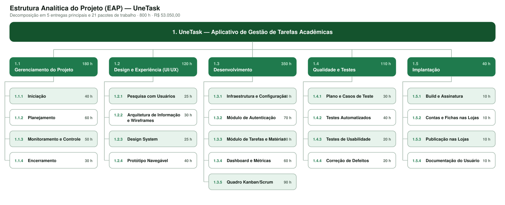
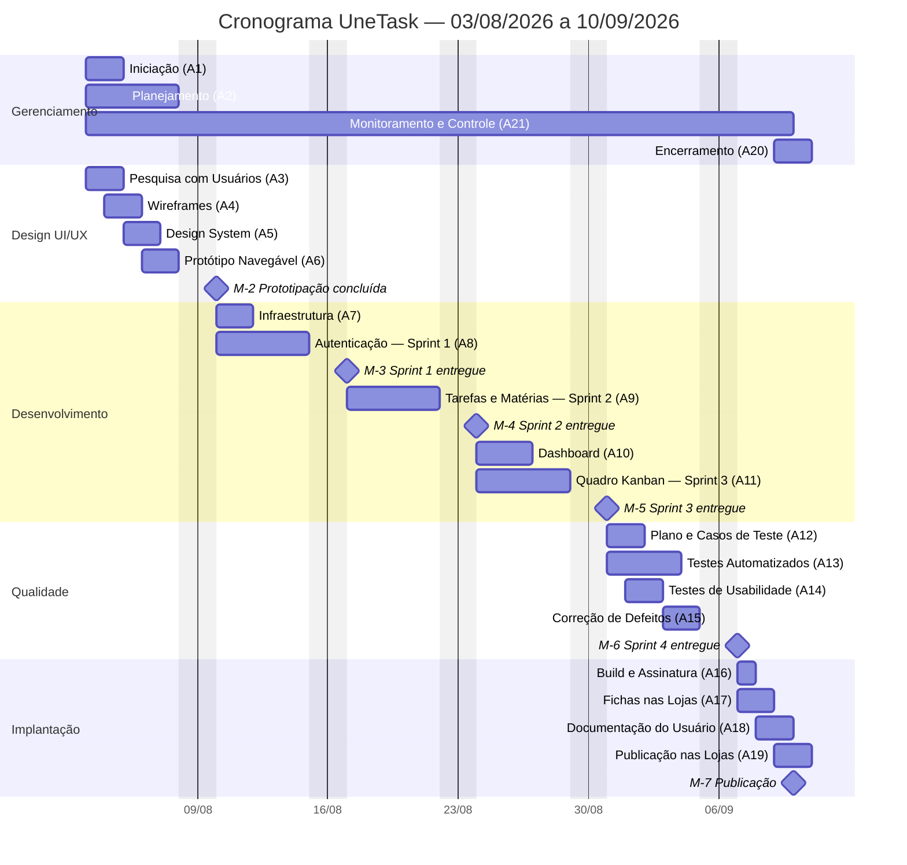

# Planejamento

# Estrutura do Documento

- [Fase de Planejamento](#planejamento)
- [Escopo do Projeto](#escopo-do-projeto)
  - [Entregas do Projeto](#entregas-do-projeto)
  - [Critérios de Aceitação](#critérios-de-aceitação)
- [Estrutura Analítica do Projeto](#estrutura-analítica-do-projeto)
  - [Dicionário da EAP](#dicionário-da-eap)
- [Matriz de Responsabilidades](#matriz-de-responsabilidades)
- [Cronograma do Projeto](#cronograma-do-projeto)
  - [Atividades e Durações](#atividades-e-durações)
  - [Linha do Tempo](#linha-do-tempo)
  - [Caminho Crítico](#caminho-crítico)
- [Orçamento do Projeto](#orçamento-do-projeto)
  - [Orçamento por Pacote de Trabalho](#orçamento-por-pacote-de-trabalho)
  - [Orçamento por Recurso](#orçamento-por-recurso)
  - [Desembolso Previsto (Linha de Base de Custos)](#desembolso-previsto-linha-de-base-de-custos)
- [Planos de Gerenciamento](#planos-de-gerenciamento)
  - [Plano de Qualidade](#plano-de-qualidade)
  - [Plano de Aquisição](#plano-de-aquisição)
  - [Plano de Comunicação](#plano-de-comunicação)
  - [Plano de Riscos](#plano-de-riscos)

# Escopo do Projeto

O escopo do projeto UneTask compreende a concepção, o design, a construção, a verificação e a publicação de uma aplicação mobile multiplataforma (Web, iOS e Android) para gestão de tarefas acadêmicas, atendendo integralmente aos requisitos funcionais **RF-001 a RF-012** e não funcionais **RNF-001 a RNF-007** definidos na [Fase de Iniciação](/docs/01-iniciacao).

O trabalho a ser realizado abrange cinco frentes: o gerenciamento do projeto (documentação, acompanhamento e encerramento), o design da experiência do usuário (pesquisa, wireframes, design system e protótipo navegável), o desenvolvimento dos módulos de autenticação, tarefas/matérias, dashboard e quadro Kanban, a garantia da qualidade (testes automatizados, testes de usabilidade e correção de defeitos) e a implantação nas lojas Google Play Store e Apple App Store.

Estão **fora do escopo** os itens registrados como contra-escopo na Declaração de Escopo (CE-001 a CE-006): integração com Google Classroom ou outros sistemas de gestão escolar, chat interno, recomendações por Inteligência Artificial, internacionalização, versão desktop e integração com calendários acadêmicos institucionais. Qualquer inclusão desses itens exige solicitação formal de mudança, avaliação de impacto em prazo e custo e aprovação do Gerente do Projeto e da Product Owner.

> 
[Declaração de Escopo](/docs/01-iniciacao/artefatos/declaracao-escopo.docx)

## Entregas do Projeto

| ID | Entrega | Descrição | Marco associado |
|----|---------|-----------|-----------------|
| E-01 | Documentação de Iniciação | Termo de Abertura, Registro de Partes Interessadas e Declaração de Escopo aprovados | M-1 |
| E-02 | Plano de Gerenciamento do Projeto | EAP, matriz RACI, cronograma, orçamento e planos de qualidade, aquisição, comunicação e riscos | M-1 |
| E-03 | Protótipo Navegável | Telas de alta fidelidade com fluxo navegável e design system aplicado | M-2 |
| E-04 | Módulo de Autenticação | Login por e-mail/senha e OAuth (Google e Apple), recuperação de senha e sessão persistente | M-3 |
| E-05 | Módulo de Tarefas e Matérias | CRUD de tarefas, categorização por matéria, listagem com filtros e exportação | M-4 |
| E-06 | Dashboard e Quadro Kanban | Painéis de status com gráficos e quadro interativo com arrastar e soltar | M-5 |
| E-07 | Produto Verificado | Suíte de testes executada, relatório de testes de usabilidade e defeitos críticos corrigidos | M-6 |
| E-08 | Produto Publicado | Aplicação disponível nas lojas, documentação do usuário e termo de encerramento | M-7 |

## Critérios de Aceitação

| ID | Critério | Métrica de aceitação |
|----|----------|----------------------|
| CA-01 | Cobertura de requisitos | 100% dos requisitos de prioridade ALTA implementados e demonstrados em Sprint Review |
| CA-02 | Ausência de defeitos críticos | Nenhum defeito de severidade crítica ou alta em aberto na entrega final |
| CA-03 | Desempenho | Tempo de resposta das operações de tarefa igual ou inferior a 3 segundos (RNF-003) |
| CA-04 | Usabilidade | Taxa de sucesso igual ou superior a 90% nas tarefas dos testes com usuários |
| CA-05 | Conformidade legal | Política de privacidade publicada e tratamento de dados aderente à LGPD (RNF-005) |
| CA-06 | Publicação | Aplicação aprovada e disponível na Google Play Store e na Apple App Store |
| CA-07 | Aceite formal | Aprovação documentada da professora responsável, Janecler Foppa |

# Estrutura Analítica do Projeto

A EAP decompõe o escopo do UneTask em 5 entregas principais e 21 pacotes de trabalho, totalizando as 800 horas e os R$ 53.050,00 previstos no Termo de Abertura. Cada pacote de trabalho é a menor unidade sobre a qual se estima esforço, se atribui responsável e se mede progresso.

> O arquivo [`images/eap-unetask.svg`](images/eap-unetask.svg) é a fonte editável do diagrama e pode ser aberto em qualquer editor vetorial ou no [Draw.io](https://app.diagrams.net/).

## Dicionário da EAP

| Código | Pacote de trabalho | Descrição do trabalho | Entregável | Responsável | Horas |
|--------|--------------------|------------------------|------------|-------------|-------|
| 1.1.1 | Iniciação | Elaborar o TAP, registrar partes interessadas e formalizar a declaração de escopo | Documentação de iniciação aprovada | Guillermo | 40 |
| 1.1.2 | Planejamento | Construir EAP, RACI, cronograma, orçamento e planos de gerenciamento | Plano do projeto | Guillermo | 60 |
| 1.1.3 | Monitoramento e Controle | Conduzir eventos Scrum, atas, relatórios de progresso e controle de mudanças | Atas e relatórios semanais | Guillermo | 50 |
| 1.1.4 | Encerramento | Consolidar aceite, lições aprendidas e termo de encerramento | Termo de encerramento | Guillermo | 30 |
| 1.2.1 | Pesquisa com Usuários | Entrevistar estudantes e consolidar dores, personas e jornadas | Relatório de pesquisa | Lucas | 25 |
| 1.2.2 | Arquitetura de Informação e Wireframes | Definir a estrutura de navegação e desenhar os wireframes das telas | Wireframes validados | Lucas | 30 |
| 1.2.3 | Design System | Definir tipografia, paleta, grid, ícones e componentes reutilizáveis | Biblioteca de componentes no Figma | Lucas | 25 |
| 1.2.4 | Protótipo Navegável | Produzir telas de alta fidelidade com navegação entre estados | Protótipo publicado | Lucas | 40 |
| 1.3.1 | Infraestrutura e Configuração | Configurar repositório, CI, projeto Flutter e serviços Firebase | Ambiente de desenvolvimento operacional | Kaiky | 40 |
| 1.3.2 | Módulo de Autenticação | Implementar login por e-mail/senha, OAuth Google e Apple e sessão | Módulo de autenticação (RF-009, RF-010) | Kaiky | 70 |
| 1.3.3 | Módulo de Tarefas e Matérias | Implementar CRUD de tarefas, categorização, filtros e exportação | Módulo de tarefas (RF-001 a RF-005, RF-011, RF-012) | Kaiky | 90 |
| 1.3.4 | Dashboard e Métricas | Implementar agregações de status e gráficos de acompanhamento | Dashboard (RF-006) | Kaiky | 60 |
| 1.3.5 | Quadro Kanban/Scrum | Implementar colunas de status, cards e arrastar e soltar | Quadro interativo (RF-007, RF-008) | Otavio | 90 |
| 1.4.1 | Plano e Casos de Teste | Elaborar plano de testes, casos e critérios de aceitação por requisito | Plano e casos de teste | Otavio | 30 |
| 1.4.2 | Testes Automatizados | Escrever e executar testes unitários, de widget e de integração | Suíte automatizada em CI | Kaiky | 40 |
| 1.4.3 | Testes de Usabilidade | Conduzir sessões moderadas com estudantes e registrar achados | Relatório de usabilidade | Lucas | 20 |
| 1.4.4 | Correção de Defeitos | Tratar os defeitos registrados nos testes e revalidar | Defeitos críticos e altos encerrados | Otavio | 20 |
| 1.5.1 | Build e Assinatura | Gerar builds de produção assinados para Android e iOS | Artefatos AAB e IPA | Kaiky | 10 |
| 1.5.2 | Contas e Fichas nas Lojas | Preparar fichas, capturas, descrição e política de privacidade | Fichas aprovadas nas lojas | Ryller | 10 |
| 1.5.3 | Publicação nas Lojas | Submeter, acompanhar revisão e liberar a aplicação | Aplicação publicada | Otavio | 10 |
| 1.5.4 | Documentação do Usuário | Produzir guia rápido de uso e FAQ | Documentação do usuário | Otavio | 10 |
| | | | | **Total** | **800** |

# Matriz de Responsabilidades

A matriz RACI abaixo atribui, para cada pacote de trabalho da EAP, quem executa (**R**esponsible), quem aprova (**A**ccountable), quem é consultado (**C**onsulted) e quem é informado (**I**nformed).

| Pacote de trabalho | Guillermo (Gerente) | Ryller (PO/Analista) | Lucas (Designer) | Kaiky (Dev/QA) | Otavio (Dev/QA) |
|--------------------|:-------------------:|:--------------------:|:----------------:|:--------------:|:---------------:|
| 1.1.1 Iniciação | R | C | I | I | I |
| 1.1.2 Planejamento | R | C | C | C | C |
| 1.1.3 Monitoramento e Controle | R | C | I | I | I |
| 1.1.4 Encerramento | R | C | C | C | C |
| 1.2.1 Pesquisa com Usuários | A | C | R | I | I |
| 1.2.2 Arquitetura de Informação e Wireframes | I | C | R | C | C |
| 1.2.3 Design System | I | I | R | C | C |
| 1.2.4 Protótipo Navegável | A | C | R | I | I |
| 1.3.1 Infraestrutura e Configuração | A | I | I | R | R |
| 1.3.2 Módulo de Autenticação | A | C | C | R | C |
| 1.3.3 Módulo de Tarefas e Matérias | A | C | C | R | C |
| 1.3.4 Dashboard e Métricas | A | C | C | R | C |
| 1.3.5 Quadro Kanban/Scrum | A | C | C | C | R |
| 1.4.1 Plano e Casos de Teste | A | C | I | C | R |
| 1.4.2 Testes Automatizados | A | I | I | R | C |
| 1.4.3 Testes de Usabilidade | A | C | R | I | I |
| 1.4.4 Correção de Defeitos | A | I | I | C | R |
| 1.5.1 Build e Assinatura | A | I | I | R | C |
| 1.5.2 Contas e Fichas nas Lojas | A | R | C | I | I |
| 1.5.3 Publicação nas Lojas | A | C | I | C | R |
| 1.5.4 Documentação do Usuário | A | C | C | I | R |

> Legenda:
> * **R** (Responsible) — executa a atividade
> * **A** (Accountable) — aprova e responde pelo resultado
> * **C** (Consulted) — é consultado antes ou durante a execução
> * **I** (Informed) — é informado do resultado

# Cronograma do Projeto

O projeto é executado em **6 semanas**, entre **03/08/2026** e **10/09/2026**, organizadas em uma semana de planejamento e design, quatro sprints semanais de desenvolvimento e verificação e uma semana final de implantação e encerramento. As sprints iniciam às segundas-feiras e o incremento é demonstrado na Sprint Review da segunda-feira seguinte, data em que o marco correspondente é registrado.

## Atividades e Durações

| ID | Atividade (pacote da EAP) | Início | Término | Duração | Responsável | Predecessora |
|----|----------------------------|--------|---------|---------|-------------|--------------|
| A1 | 1.1.1 Iniciação | 03/08/2026 | 04/08/2026 | 2 d | Guillermo | — |
| A2 | 1.1.2 Planejamento | 03/08/2026 | 07/08/2026 | 5 d | Guillermo | — |
| A3 | 1.2.1 Pesquisa com Usuários | 03/08/2026 | 04/08/2026 | 2 d | Lucas | — |
| A4 | 1.2.2 Arquitetura de Informação e Wireframes | 04/08/2026 | 05/08/2026 | 2 d | Lucas | A3 |
| A5 | 1.2.3 Design System | 05/08/2026 | 06/08/2026 | 2 d | Lucas | A4 |
| A6 | 1.2.4 Protótipo Navegável | 06/08/2026 | 07/08/2026 | 2 d | Lucas | A5 |
| A7 | 1.3.1 Infraestrutura e Configuração | 10/08/2026 | 11/08/2026 | 2 d | Kaiky / Otavio | A2 |
| A8 | 1.3.2 Módulo de Autenticação (Sprint 1) | 10/08/2026 | 14/08/2026 | 5 d | Kaiky | A6 |
| A9 | 1.3.3 Módulo de Tarefas e Matérias (Sprint 2) | 17/08/2026 | 21/08/2026 | 5 d | Kaiky | A8 |
| A10 | 1.3.4 Dashboard e Métricas (Sprint 3) | 24/08/2026 | 26/08/2026 | 3 d | Kaiky | A9 |
| A11 | 1.3.5 Quadro Kanban/Scrum (Sprint 3) | 24/08/2026 | 28/08/2026 | 5 d | Otavio | A9 |
| A12 | 1.4.1 Plano e Casos de Teste | 31/08/2026 | 01/09/2026 | 2 d | Otavio | A11 |
| A13 | 1.4.2 Testes Automatizados (Sprint 4) | 31/08/2026 | 03/09/2026 | 4 d | Kaiky | A11 |
| A14 | 1.4.3 Testes de Usabilidade | 01/09/2026 | 02/09/2026 | 2 d | Lucas | A12 |
| A15 | 1.4.4 Correção de Defeitos | 03/09/2026 | 04/09/2026 | 2 d | Otavio | A13, A14 |
| A16 | 1.5.1 Build e Assinatura | 07/09/2026 | 07/09/2026 | 1 d | Kaiky | A15 |
| A17 | 1.5.2 Contas e Fichas nas Lojas | 07/09/2026 | 08/09/2026 | 2 d | Ryller | A15 |
| A18 | 1.5.4 Documentação do Usuário | 08/09/2026 | 09/09/2026 | 2 d | Otavio | A16 |
| A19 | 1.5.3 Publicação nas Lojas | 09/09/2026 | 10/09/2026 | 2 d | Otavio | A16, A17 |
| A20 | 1.1.4 Encerramento | 09/09/2026 | 10/09/2026 | 2 d | Guillermo | A19 |
| A21 | 1.1.3 Monitoramento e Controle | 03/08/2026 | 10/09/2026 | 28 d | Guillermo | — |

## Linha do Tempo

## Caminho Crítico

O caminho crítico do projeto é **A3 → A4 → A5 → A6 → A8 → A9 → A11 → A15 → A19**, ou seja, a cadeia que liga o design da experiência ao desenvolvimento incremental, à correção de defeitos e à publicação nas lojas. Atrasos em qualquer uma dessas atividades deslocam diretamente a data de término de 10/09/2026, uma vez que não há folga entre as sprints.

As atividades A10 (Dashboard), A14 (Testes de Usabilidade), A17 (Fichas nas Lojas) e A18 (Documentação do Usuário) possuem folga de 1 a 2 dias e funcionam como amortecedor do cronograma. O controle de prazo é feito semanalmente na Sprint Review, conforme descrito na [Fase de Monitoramento](/docs/04-monitoramento).

# Orçamento do Projeto

O orçamento total do projeto é de **R$ 53.050,00**, limite estabelecido pela restrição RE-002 do Termo de Abertura. Desse montante, **R$ 52.000,00 (98,0%)** correspondem a recursos humanos — 800 horas distribuídas entre os cinco integrantes da equipe — e **R$ 1.050,00 (2,0%)** a custos de infraestrutura e licenças. Os equipamentos de desenvolvimento são de propriedade dos integrantes e, portanto, não geram custo para o projeto.

## Orçamento por Pacote de Trabalho

| Código | Pacote de trabalho | Horas | Custo de RH | Outros custos | Total |
|--------|--------------------|------:|------------:|--------------:|------:|
| 1.1.1 | Iniciação | 40 | R$ 3.000,00 | — | R$ 3.000,00 |
| 1.1.2 | Planejamento | 60 | R$ 4.600,00 | — | R$ 4.600,00 |
| 1.1.3 | Monitoramento e Controle | 50 | R$ 3.900,00 | — | R$ 3.900,00 |
| 1.1.4 | Encerramento | 30 | R$ 2.300,00 | — | R$ 2.300,00 |
| 1.2.1 | Pesquisa com Usuários | 25 | R$ 1.600,00 | — | R$ 1.600,00 |
| 1.2.2 | Arquitetura de Informação e Wireframes | 30 | R$ 1.800,00 | — | R$ 1.800,00 |
| 1.2.3 | Design System | 25 | R$ 1.500,00 | — | R$ 1.500,00 |
| 1.2.4 | Protótipo Navegável | 40 | R$ 2.400,00 | — | R$ 2.400,00 |
| 1.3.1 | Infraestrutura e Configuração | 40 | R$ 2.400,00 | R$ 300,00 | R$ 2.700,00 |
| 1.3.2 | Módulo de Autenticação | 70 | R$ 4.300,00 | — | R$ 4.300,00 |
| 1.3.3 | Módulo de Tarefas e Matérias | 90 | R$ 5.600,00 | — | R$ 5.600,00 |
| 1.3.4 | Dashboard e Métricas | 60 | R$ 3.700,00 | — | R$ 3.700,00 |
| 1.3.5 | Quadro Kanban/Scrum | 90 | R$ 5.600,00 | — | R$ 5.600,00 |
| 1.4.1 | Plano e Casos de Teste | 30 | R$ 1.900,00 | — | R$ 1.900,00 |
| 1.4.2 | Testes Automatizados | 40 | R$ 2.400,00 | — | R$ 2.400,00 |
| 1.4.3 | Testes de Usabilidade | 20 | R$ 1.300,00 | — | R$ 1.300,00 |
| 1.4.4 | Correção de Defeitos | 20 | R$ 1.200,00 | — | R$ 1.200,00 |
| 1.5.1 | Build e Assinatura | 10 | R$ 600,00 | — | R$ 600,00 |
| 1.5.2 | Contas e Fichas nas Lojas | 10 | R$ 700,00 | R$ 750,00 | R$ 1.450,00 |
| 1.5.3 | Publicação nas Lojas | 10 | R$ 600,00 | — | R$ 600,00 |
| 1.5.4 | Documentação do Usuário | 10 | R$ 600,00 | — | R$ 600,00 |
| | **Total** | **800** | **R$ 52.000,00** | **R$ 1.050,00** | **R$ 53.050,00** |

## Orçamento por Recurso

| Recurso | Papel | Valor/hora | 1.1 Gerência | 1.2 Design | 1.3 Desenv. | 1.4 Qualidade | 1.5 Implantação | Total de horas | Custo total |
|---------|-------|-----------:|-------------:|-----------:|------------:|--------------:|----------------:|---------------:|------------:|
| Guillermo Gilioli | Gerente / Scrum Master | R$ 80,00 | 120 | — | — | — | — | 120 | R$ 9.600,00 |
| Ryller Brito | Product Owner / Analista | R$ 70,00 | 60 | 10 | 60 | 20 | 10 | 160 | R$ 11.200,00 |
| Lucas da Rosa | Designer UI/UX | R$ 60,00 | — | 110 | — | 10 | — | 120 | R$ 7.200,00 |
| Kaiky Marçal | Desenvolvedor / QA | R$ 60,00 | — | — | 150 | 40 | 10 | 200 | R$ 12.000,00 |
| Otavio Maniezzo | Desenvolvedor / QA | R$ 60,00 | — | — | 140 | 40 | 20 | 200 | R$ 12.000,00 |
| | | | **180** | **120** | **350** | **110** | **40** | **800** | **R$ 52.000,00** |

| Item | Descrição | Valor |
|------|-----------|------:|
| Infraestrutura em nuvem | Firebase (Authentication, Firestore, Hosting) no período do projeto | R$ 300,00 |
| Licenças e contas de loja | Google Play Console (taxa única) e Apple Developer Program (anual) | R$ 750,00 |
| | **Total de custos não relacionados a pessoal** | **R$ 1.050,00** |

## Desembolso Previsto (Linha de Base de Custos)

| Semana | Período | Principais pacotes | Custo previsto | Acumulado | % do orçamento |
|--------|---------|--------------------|---------------:|----------:|---------------:|
| 1 | 03/08 – 07/08 | Iniciação, Planejamento e Design UI/UX | R$ 15.550,00 | R$ 15.550,00 | 29,3% |
| 2 | 10/08 – 14/08 | Infraestrutura e Autenticação (Sprint 1) | R$ 7.650,00 | R$ 23.200,00 | 43,7% |
| 3 | 17/08 – 21/08 | Tarefas e Matérias (Sprint 2) | R$ 6.250,00 | R$ 29.450,00 | 55,5% |
| 4 | 24/08 – 28/08 | Dashboard e Quadro Kanban (Sprint 3) | R$ 9.950,00 | R$ 39.400,00 | 74,3% |
| 5 | 31/08 – 04/09 | Qualidade e Testes (Sprint 4) | R$ 7.450,00 | R$ 46.850,00 | 88,3% |
| 6 | 07/09 – 10/09 | Implantação e Encerramento | R$ 6.200,00 | R$ 53.050,00 | 100,0% |

O projeto **não dispõe de reserva de contingência financeira**, pois o orçamento é um valor teto definido em RE-002. A contingência adotada é de esforço: aproximadamente 10% da capacidade semanal da equipe é mantida sem alocação no Sprint Backlog, de modo que imprevistos sejam absorvidos dentro da própria sprint sem impacto no custo total. Desvios acima de 5% no índice de desempenho de custos (IDC) devem ser tratados como solicitação de mudança, conforme o processo descrito na [Fase de Monitoramento](/docs/04-monitoramento).

# Planos de Gerenciamento

## Plano de Qualidade

A estratégia de qualidade do UneTask é preventiva: a verificação ocorre a cada sprint, integrada ao fluxo de desenvolvimento, e não em uma etapa final de testes. Todo artefato produzido passa por revisão por pares antes de ser considerado concluído, todo código entra na branch principal por meio de *pull request* com aprovação obrigatória de um segundo integrante, e a suíte de testes automatizados é executada pela integração contínua a cada envio. A qualidade do produto é avaliada segundo as características de adequação funcional, desempenho, usabilidade, confiabilidade e segurança da norma ISO/IEC 25010.

A Definição de Pronto (DoD) adotada pela equipe estabelece que um item do Sprint Backlog só é considerado concluído quando: o código foi revisado e integrado, os testes automatizados correspondentes passam, o item foi validado contra os critérios de aceitação pela Product Owner, e o incremento foi demonstrado na Sprint Review.

### Artefatos a serem verificados

| Artefato | Tipo Verif. | Data | Responsável | Métrica | Data Correção | Ação Não Conform. | Resp. Avaliação | Resp. Correção |
|----------|-------------|------|-------------|---------|---------------|-------------------|-----------------|----------------|
| Declaração de Escopo | Inspeção | 04/08/2026 | Ryller | 100% dos requisitos rastreáveis a um objetivo específico | 05/08/2026 | Revisar e reemitir o documento | Guillermo | Ryller |
| Protótipo Navegável | Revisão de design | 07/08/2026 | Lucas | 100% das telas aderentes ao design system | 10/08/2026 | Ajustar componentes divergentes | Ryller | Lucas |
| Código-fonte (por PR) | Code review | Contínua | Kaiky / Otavio | 0 PR integrado sem aprovação de revisor | Contínua | Bloquear merge até correção | Guillermo | Autor do PR |
| Suíte de testes automatizados | Execução em CI | Contínua | Kaiky | Cobertura mínima de 70% nas camadas de domínio e dados | Sprint seguinte | Criar tarefa de cobertura no backlog | Otavio | Kaiky |
| Incremento da Sprint | Teste funcional | Sexta de cada sprint | Otavio | 100% dos critérios de aceitação atendidos | Sprint seguinte | Retornar item ao Sprint Backlog | Ryller | Equipe de desenvolvimento |
| Relatório de Usabilidade | Teste com usuários | 02/09/2026 | Lucas | Taxa de sucesso maior ou igual a 90% por tarefa | 04/09/2026 | Priorizar ajuste de interface | Ryller | Lucas |
| Build de produção | Checklist de publicação | 07/09/2026 | Kaiky | 0 item pendente no checklist das lojas | 08/09/2026 | Refazer build e reenviar | Guillermo | Kaiky |
| Documentação do projeto | Inspeção | 09/09/2026 | Guillermo | 100% das fases documentadas no repositório | 10/09/2026 | Complementar seções ausentes | Janecler Foppa | Guillermo |

### Padrões e Normas Utilizadas

| Nome | Descrição |
|------|-----------|
| ISO/IEC 25010 | Modelo de qualidade de produto de software utilizado como referência para os requisitos não funcionais |
| Lei nº 13.709/2018 (LGPD) | Base legal para coleta, armazenamento, portabilidade e eliminação dos dados dos estudantes |
| WCAG 2.1 — nível AA | Diretrizes de acessibilidade aplicadas a contraste, tamanho de alvo de toque e leitores de tela |
| Material Design 3 | Padrão de interface adotado na versão Android e Web |
| Apple Human Interface Guidelines | Padrão de interface adotado na versão iOS e requisito da revisão da App Store |
| Effective Dart | Guia de estilo e convenções de código para a linguagem Dart |
| Conventional Commits | Padrão de mensagens de commit, base para o histórico e o versionamento semântico |
| Semantic Versioning 2.0.0 | Critério de numeração das versões publicadas nas lojas |

### Ambiente das Atividades de Qualidade

| Ambiente | Descrição |
|----------|-----------|
| Desenvolvimento | Máquina local de cada integrante, com emuladores Android e iOS e projeto Firebase de desenvolvimento |
| Integração Contínua | GitHub Actions executando análise estática, testes unitários e de widget a cada *pull request* |
| Homologação | Distribuição interna via Firebase App Distribution (Android) e TestFlight (iOS) para validação da PO |
| Testes de Usabilidade | Sessões moderadas com estudantes, realizadas em dispositivo físico com roteiro de tarefas |
| Produção | Google Play Store e Apple App Store, com monitoramento de falhas por Firebase Crashlytics |

### Equipe de Qualidade

| Nome | Responsabilidade |
|------|------------------|
| Otavio Maniezzo | Líder de qualidade: elabora o plano e os casos de teste, executa testes funcionais e consolida o registro de defeitos |
| Kaiky Marçal | Implementa e mantém a suíte de testes automatizados e a integração contínua |
| Lucas da Rosa | Conduz os testes de usabilidade e verifica a aderência da interface ao design system e à acessibilidade |
| Ryller Brito | Valida os incrementos contra os critérios de aceitação e aprova ou rejeita os itens na Sprint Review |
| Guillermo Gilioli | Garante a execução do processo de qualidade, acompanha indicadores e responde pelas não conformidades |

### Metodologias de Qualidade Utilizadas

| Nome | Descrição |
|------|-----------|
| Revisão por pares (code review) | Todo *pull request* exige aprovação de um segundo integrante antes da integração |
| Testes automatizados | Testes unitários e de widget com `flutter_test` e testes de fluxo com `integration_test`, executados em CI |
| Inspeção por checklist | Verificação formal de artefatos de documentação e do build de publicação |
| Teste de usabilidade moderado | Sessões com estudantes executando tarefas reais, com medição de taxa de sucesso e tempo |
| Definição de Pronto (DoD) | Critério único e explícito de conclusão aplicado a todos os itens do Sprint Backlog |
| Retrospectiva de sprint | Análise semanal do processo, com ações de melhoria registradas e acompanhadas na sprint seguinte |

## Plano de Aquisição

As aquisições do UneTask são de baixa complexidade e se concentram em contas de desenvolvedor e serviços em nuvem, sem contratação de fornecedores de desenvolvimento. A responsabilidade pela contratação é do Gerente do Projeto, com execução operacional da Product Owner, e o critério de seleção privilegia serviços já estabelecidos no mercado, com planos gratuitos ou de baixo custo compatíveis com a restrição orçamentária RE-002.

As contas nas lojas são condição para o início do projeto (CI-004) e devem estar ativas na primeira semana, pois o prazo de aprovação da conta Apple Developer pode chegar a 15 dias e representa um risco direto ao marco M-7.

| ID | Item a adquirir | Tipo | Fornecedor | Critério de seleção | Custo | Prazo de contratação | Responsável |
|----|-----------------|------|------------|---------------------|------:|----------------------|-------------|
| AQ-01 | Apple Developer Program | Licença anual | Apple | Obrigatório para publicação na App Store (RE-005) | R$ 620,00 | Até 05/08/2026 | Ryller |
| AQ-02 | Google Play Console | Taxa única de registro | Google | Obrigatório para publicação na Play Store (RE-005) | R$ 130,00 | Até 05/08/2026 | Ryller |
| AQ-03 | Firebase (plano Blaze) | Serviço em nuvem | Google | Integração nativa com Flutter, sincronização em tempo real e camada gratuita suficiente para o piloto | R$ 300,00 | Até 10/08/2026 | Kaiky |
| AQ-04 | Figma | Licença de design | Figma | Plano educacional gratuito, com recurso de protótipo navegável e handoff | R$ 0,00 | Até 03/08/2026 | Lucas |
| AQ-05 | GitHub (repositório e Actions) | Serviço de desenvolvimento | GitHub | Plano gratuito atende ao versionamento, ao quadro Kanban e à CI (RE-004) | R$ 0,00 | Até 03/08/2026 | Guillermo |
| | | | | **Total** | **R$ 1.050,00** | | |

## Plano de Comunicação

A comunicação do projeto segue o ritmo do Scrum: a sincronização diária ocorre de forma assíncrona em canal de mensagens, as decisões de escopo são tomadas nas cerimônias semanais e todo registro formal é versionado no repositório do GitHub, que é a fonte única de verdade do projeto. Nenhuma decisão que altere escopo, prazo ou custo é considerada válida se comunicada apenas verbalmente: ela deve constar em ata de reunião ou em solicitação de mudança registrada.

### Plano de Comunicação do Projeto

| Entregável | Público Alvo | Met. Comunicação | Frequência | Responsável |
|------------|--------------|------------------|------------|-------------|
| Ata de reunião | Equipe e professora responsável | Documento no repositório (GitHub) | Semanal | Guillermo |
| Declaração de escopo | Equipe e professora responsável | Documento no repositório + reunião de alinhamento | Uma vez, na iniciação | Ryller |
| EAP | Equipe | Documento no repositório + apresentação no planejamento | Uma vez, na iniciação | Guillermo |
| Dicionário da EAP | Equipe de desenvolvimento | Documento no repositório | Uma vez, com atualização por mudança aprovada | Guillermo |
| Cronograma | Equipe e professora responsável | Documento no repositório + quadro no GitHub Projects | Semanal (atualização) | Guillermo |
| Lista de Riscos | Equipe e professora responsável | Documento no repositório | Semanal (revisão) | Guillermo |
| Plano de qualidade | Equipe | Documento no repositório | Uma vez, com revisão por sprint | Otavio |
| Plano de projeto | Professora responsável | Documento no repositório + apresentação | Uma vez, na fase de planejamento | Guillermo |
| Relatório de Progresso | Professora responsável e equipe | Relatório no repositório + Sprint Review (reunião) | Semanal, às segundas-feiras | Guillermo |
| Relatório de Aderência ao Processo | Equipe | Retrospectiva (reunião) | Ao final de cada sprint | Guillermo |
| Checklists de Inspeção | Equipe de qualidade | Documento no repositório | Por artefato verificado | Otavio |
| Incremento do produto | Professora responsável e usuários piloto | Demonstração na Sprint Review + build de homologação | Ao final de cada sprint | Ryller |
| Solicitação de mudança | Equipe e professora responsável | Registro de mudanças no repositório | Sob demanda | Guillermo |
| Registro de defeitos | Equipe de desenvolvimento | Issues no GitHub | Contínua | Otavio |
| Sincronização diária | Equipe | Mensagem assíncrona em grupo (Daily Scrum) | Diária | Equipe |
| Termo de encerramento | Professora responsável e equipe | Documento no repositório + reunião de encerramento | Uma vez, no encerramento | Guillermo |

> Legenda:
> - Público: a quem se destina a comunicação.
> - Método de Comunicação: e-mail, reunião presencial, reunião virtual, etc.
> - Frequência: diária, semanal, quinzenal, mensal, etc.
> - Responsável: pessoa responsável pela comunicação.

### Plano de Gerência de Comunicação

- **Ferramentas utilizadas:**
  - [GitHub — repositório, documentação e Issues](https://github.com/lucasrveni/gerencia-projeto-software)
  - [GitHub Projects — quadro Kanban e Sprint Board](https://github.com/users/lucasrveni/projects/5/views/1?system_template=kanban)
  - [Figma — protótipo navegável e design system](https://www.figma.com/design/wSAvNL98JkSHNnCq0Lweqw/UneTask?node-id=0-1&t=Nlw634oMXg86fAxf-1)
  - [GitHub Pages — publicação do protótipo navegável](https://lucasrveni.github.io/gerencia-projeto-software/)
  - Grupo de mensagens da equipe — Daily Scrum assíncrona e alinhamentos rápidos
  - Videoconferência — Sprint Planning, Review e Retrospective

- **Papéis:**
  - **Guillermo Gilioli (Gerente / Scrum Master):** responsável pela comunicação oficial do projeto, pela condução das cerimônias e pelo relacionamento com a professora responsável.
  - **Ryller Brito (Product Owner):** responsável por comunicar prioridades, critérios de aceitação e resultados das validações.
  - **Lucas da Rosa (Designer):** responsável por comunicar decisões de interface e os achados dos testes de usabilidade.
  - **Kaiky Marçal e Otavio Maniezzo (Desenvolvedores/QA):** responsáveis por comunicar impedimentos técnicos, status das tarefas no quadro e registro de defeitos.

- **Princípios gerais:**
  - **Clareza:** a comunicação usa linguagem direta e evita ambiguidade; termos técnicos são explicados quando o público inclui partes interessadas não técnicas.
  - **Objetividade:** cada comunicação indica o que mudou, qual a decisão e qual a próxima ação esperada, sem digressões.
  - **Transparência:** impedimentos, atrasos e defeitos são comunicados assim que identificados, e não apenas quando resolvidos.
  - **Rastreabilidade:** toda decisão relevante é registrada em ata ou solicitação de mudança versionada no repositório.
  - **Cordialidade e imparcialidade:** as críticas dirigem-se ao artefato ou ao processo, nunca à pessoa, e as retrospectivas seguem essa regra explicitamente.

- **Plano de Gerência de Configuração:**
  - O versionamento é feito com **Git**, no repositório remoto do **GitHub**, adotando-se o fluxo de *feature branches*: cada item do Sprint Backlog é desenvolvido em uma branch derivada de `main`, nomeada como `feat/<id-da-tarefa>-<descricao-curta>` ou `fix/<id-da-tarefa>-<descricao-curta>`.
  - A integração em `main` ocorre exclusivamente por *pull request* com aprovação de, no mínimo, um revisor e com a suíte de CI aprovada; a branch `main` permanece sempre em estado publicável.
  - As mensagens de commit seguem o padrão **Conventional Commits** e as versões publicadas seguem o **Semantic Versioning**, com *tag* no repositório a cada entrega nas lojas.
  - A documentação do projeto é versionada junto ao código, em `docs/`, de modo que cada versão do produto tenha a documentação correspondente; os registros complementares, como as atas de reunião, ficam em `artefatos/` dentro da fase a que pertencem, também em Markdown, para que possam ser revisados por *pull request*.

## Plano de Riscos

Os riscos do UneTask concentram-se no prazo — seis semanas com quatro sprints de apenas uma semana e nenhuma folga entre elas — e na dependência de terceiros para a publicação nas lojas. A lista de riscos é revisada semanalmente na Sprint Review; riscos classificados como **Alto** são acompanhados no relatório de progresso e possuem responsável nominal pela contramedida.

| ID | Categoria do Risco | Descrição do Risco | Probabilidade | Impacto | Risco | Medidas de Prevenção (Contramedidas) | Medidas de Contingência (Mitigação) |
|----|--------------------|--------------------|---------------|---------|-------|--------------------------------------|-------------------------------------|
| R-01 | Cronograma | Sprints de uma semana sem folga entre entregas tornam o cronograma sensível a qualquer atraso | Alta | Alto | **Alto** | Manter 10% da capacidade da sprint sem alocação; priorizar por valor; congelar escopo após o Sprint Planning | Repriorizar itens de prioridade MÉDIA para a sprint seguinte, preservando os requisitos de prioridade ALTA |
| R-02 | Aquisição | Atraso na aprovação da conta Apple Developer inviabiliza a publicação na App Store | Média | Alto | **Alto** | Iniciar o cadastro na primeira semana do projeto (CI-004) e acompanhar o status a cada dois dias | Publicar primeiro na Google Play e distribuir a versão iOS por TestFlight até a liberação da conta |
| R-03 | Técnico | Reprovação do aplicativo na revisão da App Store por não conformidade com as diretrizes | Média | Alto | **Alto** | Aplicar o checklist de publicação e as Human Interface Guidelines desde o design; revisar política de privacidade | Corrigir os apontamentos e reenviar em até 48 horas; acionar o canal de revisão acelerada |
| R-04 | Recursos Humanos | Indisponibilidade de integrante por sobreposição com outras disciplinas ou trabalho | Média | Alto | **Alto** | Distribuir conhecimento por pareamento; manter o quadro atualizado para visibilidade das tarefas | Redistribuir as tarefas entre os demais integrantes e reduzir o escopo da sprint corrente |
| R-05 | Qualidade | Defeitos críticos descobertos apenas na sprint de testes, próxima ao encerramento | Média | Alto | **Alto** | Testar a cada sprint com a Definição de Pronto; manter a CI executando a suíte a cada PR | Acionar a folga da semana de implantação e priorizar somente defeitos críticos e altos |
| R-06 | Escopo | Inclusão de novas funcionalidades durante a execução (*scope creep*) | Alta | Médio | **Alto** | Escopo formalizado na Declaração de Escopo e contra-escopo explícito; toda mudança passa por avaliação de impacto | Aprovar a mudança apenas mediante remoção equivalente de escopo ou repactuação do marco |
| R-07 | Técnico | Curva de aprendizado da equipe em Flutter e Firebase reduz a velocidade das primeiras sprints | Média | Médio | **Médio** | Concentrar a configuração de infraestrutura na Sprint 1 e adotar pareamento nas tarefas iniciais | Reduzir o escopo da Sprint 1 e transferir itens de menor prioridade para a Sprint 2 |
| R-08 | Técnico | Conflitos de sincronização entre dispositivos no uso offline comprometem a consistência dos dados | Média | Médio | **Médio** | Adotar a persistência offline do Firestore com resolução por carimbo de tempo e testes de cenário offline | Bloquear a edição concorrente do mesmo card e exibir aviso de conflito ao usuário |
| R-09 | Legal | Tratamento de dados de estudantes em desacordo com a LGPD | Baixa | Alto | **Médio** | Coletar o mínimo de dados necessário, publicar política de privacidade e implementar exclusão de conta | Suspender a coleta do dado não conforme, corrigir o fluxo e publicar atualização emergencial |
| R-10 | Orçamento | Consumo do Firebase acima da camada gratuita eleva o custo de infraestrutura | Baixa | Médio | **Médio** | Configurar alerta de orçamento no projeto Firebase e limitar leituras com cache local | Ativar limites de cota e otimizar consultas e índices antes de ampliar o plano contratado |
| R-11 | Cliente | Desalinhamento entre o entendimento da equipe e as expectativas da professora responsável | Baixa | Médio | **Médio** | Validar o incremento em toda Sprint Review e registrar decisões em ata | Reunião extraordinária de alinhamento e repactuação dos critérios de aceitação |
| R-12 | Comunicação | Decisões tomadas em conversas informais não chegam a toda a equipe | Média | Baixo | **Médio** | Registrar toda decisão relevante em ata e no quadro do projeto | Revisar as decisões pendentes na Daily Scrum seguinte e formalizá-las em ata |

> Indique:
> Categoria do Risco: *ex.: Cliente, Cronograma, Orçamento, Aquisição de produtos, etc*
> Descrição do Risco: *ex.: Cliente não aparenta ter muito interesse no projeto*
> Impacto: *Baixo / Médio / Alto*
> Risco: *Baixo / Médio / Alto*
> Medidas de Prevenção: *Medidas que devem ser adotadas para evitar que o risco se concretize*
> Medidas de Contingência: *Medidas que devem ser adotadas caso o risco se concretize*

| Probabilidade | Impacto | Risco |
|---------------|---------------|---------------|
| Baixo | Baixo | Baixo |
| Médio | Médio | Médio |
| Alto | Alto | Alto |
| Baixo | Médio | Médio |
| Médio | Baixo | Médio |
| Baixo | Alto | Médio |
| Alto | Baixo | Médio |
| Médio | Alto | Alto |
| Alto | Médio | Alto |
