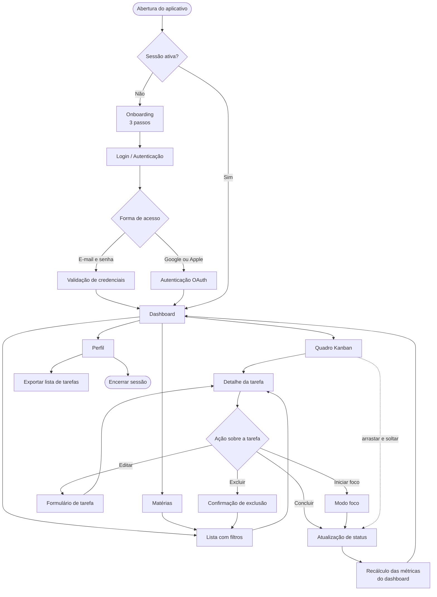
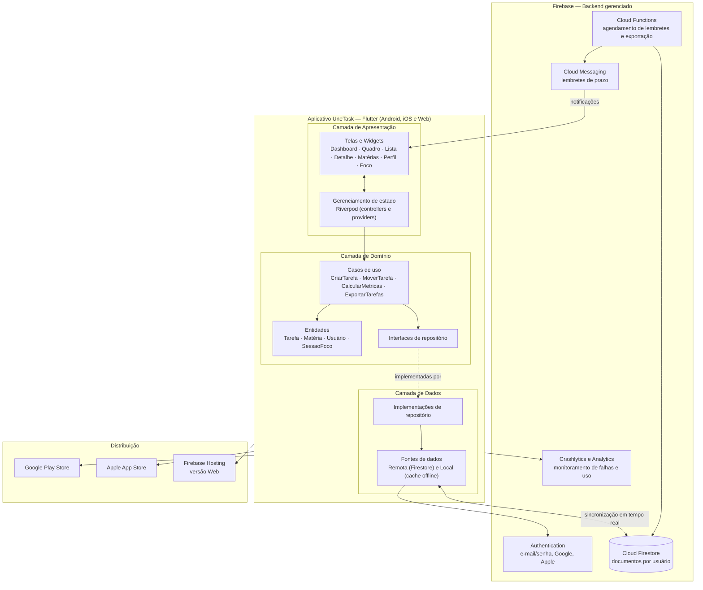
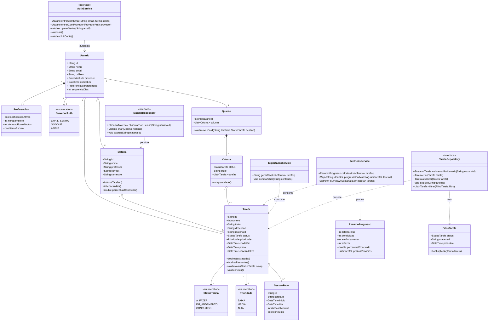
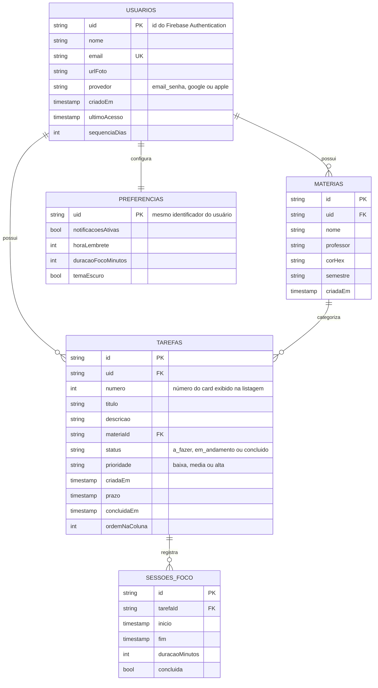

# Execução

```diff
- Esta seção simula a execução do projeto.
- Devido às características da disciplina, o software não foi implementado em código (tempo insuficiente).
- A construção do sistema é representada por um protótipo navegável, que materializa as interfaces,
- e por diagramas de arquitetura, de classes e de dados, que representam a modelagem e a implementação.
```

# Estrutura do Documento

- [Fase de Execução](#execução)
- [Interfaces do Sistema](#interfaces-do-sistema)
  - [Telas do Protótipo](#telas-do-protótipo)
  - [Fluxo do Usuário](#fluxo-do-usuário)
  - [Mudanças de Escopo Incorporadas](#mudanças-de-escopo-incorporadas)
- [Modelagem da Solução](#modelagem-da-solução)
  - [Arquitetura da Solução](#arquitetura-da-solução)
  - [Diagrama de Classes](#diagrama-de-classes)
  - [Persistência dos Dados](#persistência-dos-dados)

# Interfaces do Sistema

O protótipo navegável do UneTask cobre os requisitos funcionais RF-001 a RF-012 e as duas funcionalidades incorporadas por mudança aprovada durante a execução. Ele permite percorrer o fluxo completo do estudante — da apresentação inicial ao acompanhamento do progresso — sem necessidade de instalação, servindo de base para a validação com usuários e de referência visual para a implementação.

> 
[Protótipo navegável publicado](https://lucasrveni.github.io/gerencia-projeto-software/)

> 
[Arquivo de design no Figma](https://www.figma.com/design/wSAvNL98JkSHNnCq0Lweqw/UneTask?node-id=0-1&t=Nlw634oMXg86fAxf-1)

## Telas do Protótipo

| # | Tela | Objetivo | Principais elementos | Requisitos atendidos |
|---|------|----------|----------------------|----------------------|
| 01 | Onboarding | Apresentar a proposta de valor em três passos e conduzir ao cadastro ou login | Ilustração da marca, texto de valor, indicador de passo e ação principal | RNF-006 |
| 02 | Login / Autenticação | Autenticar o estudante por credenciais próprias ou provedores externos | Campos de e-mail e senha, recuperação de senha, botões Google e Apple | RF-009, RF-010 |
| 03 | Dashboard | Dar a visão imediata do progresso do dia e da carga de trabalho | Gráfico de rosca por status, sequência de dias, burndown pessoal, progresso por matéria e prazos próximos | RF-006, RF-012 |
| 04 | Quadro Kanban | Controlar o fluxo das atividades da semana | Colunas A Fazer, Em Andamento e Concluído, cards com número, matéria e prazo, arrastar e soltar | RF-007, RF-008 |
| 05 | Lista com filtros | Localizar tarefas em qualquer status ou matéria | Filtros por status e por matéria, contador de resultados e cards com prazo e data de criação | RF-005, RF-012 |
| 06 | Detalhe da tarefa | Consultar, editar, excluir e evoluir uma tarefa | Descrição, prazo, autoria, linha do tempo do ciclo de vida e ações Editar, Excluir, Iniciar foco e Concluir | RF-001, RF-002, RF-003, RF-012 |
| 07 | Matérias | Organizar as disciplinas do semestre e ver o avanço em cada uma | Cartão por matéria com professor, proporção de tarefas concluídas, tarefas em aberto e próximo prazo | RF-004 |
| 08 | Perfil | Reunir dados da conta, preferências e exportação de dados | Dados do estudante, preferências de notificação, exportação da lista de tarefas e encerramento de sessão | RF-011, RNF-005 |
| 09 | Modo foco | Sustentar a concentração em uma tarefa específica por ciclos cronometrados | Temporizador de 25 minutos, tarefa em foco e controles de início e pausa | RF-013 |

As cores das matérias são geradas na mesma família cromática em todas as telas, de modo que a leitura de uma disciplina seja consistente entre o gráfico do dashboard, os cards do quadro e os itens da lista. O quadro aceita tanto o gesto de arrastar cards entre colunas quanto um toque simples para avançar o status, alternativa necessária para acessibilidade e para telas menores (RNF-002, RNF-006).

## Fluxo do Usuário



O fluxo tem o Dashboard como centro: toda navegação parte dele e a ele retorna após a conclusão de uma tarefa, reforçando a percepção de progresso, que é o principal objetivo do produto. A criação de tarefas é acessível diretamente do Quadro e da Lista, em no máximo dois toques a partir de qualquer ponto do aplicativo.

## Mudanças de Escopo Incorporadas

Durante a execução, quatro solicitações de mudança foram avaliadas e aprovadas pelo controle integrado de mudanças, descrito na [Fase de Monitoramento](/docs/04-monitoramento). Elas explicam as diferenças entre o escopo preliminar da iniciação e o protótipo entregue.

| ID | Mudança | Origem | Impacto no escopo |
|----|---------|--------|-------------------|
| SM-01 | Ampliação do protótipo de 3 para 9 telas | Teste de usabilidade indicou que 3 telas não permitiam validar o fluxo completo | Aumento de 10 h em 1.2.4, absorvido pela folga da semana de design |
| SM-02 | Inclusão do Modo foco (RF-013) | Pesquisa com usuários apontou a dificuldade de concentração como dor recorrente | Aumento de 20 h, compensado por SM-03 |
| SM-03 | Simplificação da exportação (RF-011) para o formato CSV | Análise técnica mostrou baixo valor incremental de outros formatos no piloto | Redução de 20 h em 1.3.3 |
| SM-04 | Inclusão da tela de Perfil (RF-014) | Necessidade de abrigar as ações de LGPD (exportação e exclusão de dados) em local próprio | Aumento de 10 h, absorvido pela folga da Sprint 2 |

# Modelagem da Solução

A modelagem do UneTask parte de três decisões tomadas ainda no planejamento: a aplicação é multiplataforma a partir de uma única base de código, o backend é um serviço gerenciado (BaaS) em vez de infraestrutura própria, e os dados são organizados por usuário, de modo que a sincronização em tempo real e o isolamento exigido pela LGPD sejam consequência natural do modelo, e não controles acrescentados depois.

## Arquitetura da solução

A solução adota uma **arquitetura em camadas no cliente (Clean Architecture) com backend serverless gerenciado pelo Firebase**. O aplicativo Flutter concentra apresentação, domínio e acesso a dados; os serviços de autenticação, banco de dados, notificações e monitoramento são consumidos como serviços gerenciados, sem servidores mantidos pela equipe.



**Justificativa da arquitetura.** A escolha foi avaliada frente a três alternativas: aplicações nativas separadas para Android e iOS, arquitetura de microsserviços com backend próprio e a solução adotada.

| Critério | Nativo por plataforma | Microsserviços com backend próprio | **Flutter + Firebase (adotada)** |
|----------|----------------------|------------------------------------|----------------------------------|
| Esforço de desenvolvimento | Duas bases de código, esforço aproximadamente dobrado | Backend adicional a construir, operar e testar | Base única para Web, iOS e Android, compatível com as 350 h previstas |
| Custo de infraestrutura | Baixo | Alto (servidores, orquestração e operação contínua) | R$ 300,00 no período, dentro da camada gratuita para o volume do piloto |
| Sincronização em tempo real (RNF-004) | Implementação própria | Implementação própria com mensageria | Nativa no Firestore, com listeners e cache offline |
| Disponibilidade (RNF-007) | Depende da infraestrutura contratada | Exige redundância projetada pela equipe | Acordo de nível de serviço de 99,95% do provedor |
| Adequação ao tamanho da equipe | Exigiria especialistas por plataforma | Exigiria perfil de operação/DevOps inexistente na equipe | Cinco integrantes, dois deles desenvolvedores, sem perfil de operação |
| Escalabilidade futura | Limitada pelo esforço de manutenção | Alta, porém desproporcional ao problema | Escala automática por demanda, suficiente para o crescimento previsto |

A arquitetura em camadas foi mantida mesmo com o uso de um BaaS por uma razão específica: as regras de negócio — cálculo de métricas, transições de status e validação de prazos — ficam isoladas na camada de domínio, sem dependência do SDK do Firebase. Isso permite testá-las sem acesso à rede e substituir o provedor de dados no futuro alterando apenas a camada de dados, o que reduz o risco de aprisionamento tecnológico sem custo adicional no presente.

## Diagrama de Classes

O modelo de domínio é organizado em torno de três entidades centrais — `Usuario`, `Materia` e `Tarefa` — e dos serviços que operam sobre elas. O status da tarefa é um tipo enumerado, e não texto livre, porque é ele que alimenta simultaneamente as colunas do quadro, os filtros da lista e as agregações do dashboard.



**Leitura do diagrama.** `Usuario` agrega suas próprias matérias e tarefas — não há dados compartilhados entre estudantes, o que simplifica as regras de segurança e atende ao princípio da minimização de dados da LGPD. `Tarefa` é a entidade central e mantém o comportamento junto do estado: é a própria tarefa que sabe se está atrasada, quantos dias restam e como transitar de status, evitando que essa regra se espalhe pelas telas. `Quadro` é uma projeção do conjunto de tarefas em três colunas, e não uma estrutura persistida, de modo que o quadro e a lista nunca divergem. `MetricasService` e `ExportacaoService` são serviços sem estado que consomem a lista de tarefas e produzem, respectivamente, o resumo apresentado no dashboard e o arquivo CSV de exportação.

## Persistência dos Dados

A persistência utiliza o **Cloud Firestore**, banco de dados NoSQL orientado a documentos, escolhido por três características que atendem diretamente aos requisitos não funcionais: sincronização em tempo real entre dispositivos por meio de *listeners* (RNF-004), cache local automático que mantém a aplicação utilizável sem conexão, e regras de segurança declarativas aplicadas no servidor, que garantem o isolamento dos dados de cada estudante (RNF-005).

O banco de dados é nomeado **`unetask-prod`** e organizado de forma hierárquica, com todos os dados do estudante em subcoleções sob o seu documento de usuário. Essa decisão elimina a necessidade de filtrar por identificador de usuário em cada consulta e permite que a regra de segurança seja expressa em uma única condição: um documento só é acessível se o seu caminho contiver o identificador do usuário autenticado.



### Estrutura das coleções

| Caminho | Tipo | Conteúdo |
|---------|------|----------|
| `usuarios/{uid}` | Documento | Dados de perfil e preferências do estudante |
| `usuarios/{uid}/materias/{materiaId}` | Subcoleção | Disciplinas do semestre, com nome, professor e cor |
| `usuarios/{uid}/tarefas/{tarefaId}` | Subcoleção | Tarefas do estudante, com status, prazo e vínculo com a matéria |
| `usuarios/{uid}/tarefas/{tarefaId}/sessoesFoco/{sessaoId}` | Subcoleção | Ciclos de foco executados sobre a tarefa |

### Decisões de modelagem

- **Denormalização controlada:** cada tarefa armazena o `materiaId` e também o nome e a cor da matéria no momento da consulta, evitando leituras adicionais para renderizar a lista e o quadro. A atualização de uma matéria dispara uma Cloud Function que propaga a alteração para as tarefas relacionadas.
- **Ordenação persistida:** o campo `ordemNaColuna` guarda a posição do card dentro da coluna, de modo que o resultado do arrastar e soltar (RF-008) seja preservado entre dispositivos.
- **Índices compostos:** foram definidos índices para `(status, prazo)` e `(materiaId, status)`, que sustentam os filtros da tela de listagem (RF-005) e as agregações do dashboard (RF-006) sem varredura completa da coleção.
- **Persistência offline:** o cache local do Firestore permanece habilitado; alterações feitas sem conexão são enfileiradas e sincronizadas na reconexão, com resolução de conflito pelo carimbo de tempo mais recente da escrita.
- **Acesso aos dados no aplicativo:** a camada de dados usa o SDK `cloud_firestore` encapsulado nas implementações de repositório; nenhuma tela acessa o SDK diretamente, o que mantém o domínio testável sem rede.
- **Conformidade com a LGPD:** a exclusão da conta remove, em uma única operação em lote, o documento do usuário e todas as suas subcoleções; a exportação em CSV (RF-011) atende ao direito de portabilidade dos dados a partir da tela de Perfil.
