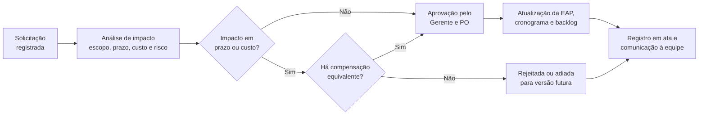

# Monitoramento

# Estrutura do Documento

- [Fase de Monitoramento](#monitoramento)
- [Processo de Monitoramento e Controle](#processo-de-monitoramento-e-controle)
- [Desempenho do Projeto](#desempenho-do-projeto)
  - [Indicadores de Prazo e Custo](#indicadores-de-prazo-e-custo)
  - [Desempenho das Sprints](#desempenho-das-sprints)
  - [Acompanhamento dos Marcos](#acompanhamento-dos-marcos)
- [Controle Integrado de Mudanças](#controle-integrado-de-mudanças)
- [Monitoramento de Riscos](#monitoramento-de-riscos)
- [Controle da Qualidade](#controle-da-qualidade)
- [Atas de Reunião](#atas-de-reunião)

# Processo de Monitoramento e Controle

O monitoramento do UneTask ocorreu em paralelo a todas as demais fases, entre 03/08/2026 e 10/09/2026, com quatro instrumentos de controle:

| Instrumento | Frequência | Responsável | Finalidade |
|-------------|------------|-------------|------------|
| Daily Scrum assíncrona | Diária | Equipe | Identificar impedimentos em até 24 horas |
| Quadro no GitHub Projects | Contínua | Equipe | Tornar visível o status real de cada item do Sprint Backlog |
| Sprint Review e Retrospectiva | Semanal (segundas-feiras) | Guillermo | Validar o incremento, medir prazo e custo e registrar melhorias |
| Relatório de progresso | Semanal | Guillermo | Consolidar indicadores, riscos e mudanças para a professora responsável |

O controle de prazo e custo utilizou a técnica do **valor agregado (EVM)**, comparando o valor planejado (VP) da linha de base de custos definida no [Planejamento](/docs/02-planejamento) com o valor agregado (VA) pelas entregas aceitas e com o custo real (CR) das horas efetivamente trabalhadas. O limite de tolerância acordado foi de 5%: desvios superiores no índice de desempenho de prazos (IDP) ou de custos (IDC) exigiriam solicitação formal de mudança.

# Desempenho do Projeto

## Indicadores de Prazo e Custo

| Semana | Data de corte | VP acumulado | VA acumulado | CR acumulado | VPr (VA−VP) | VC (VA−CR) | IDP | IDC |
|--------|---------------|-------------:|-------------:|-------------:|------------:|-----------:|----:|----:|
| 1 | 07/08/2026 | R$ 15.550,00 | R$ 15.550,00 | R$ 15.860,00 | R$ 0,00 | −R$ 310,00 | 1,00 | 0,98 |
| 2 | 14/08/2026 | R$ 23.200,00 | R$ 22.800,00 | R$ 23.400,00 | −R$ 400,00 | −R$ 600,00 | 0,98 | 0,97 |
| 3 | 21/08/2026 | R$ 29.450,00 | R$ 29.450,00 | R$ 29.900,00 | R$ 0,00 | −R$ 450,00 | 1,00 | 0,98 |
| 4 | 28/08/2026 | R$ 39.400,00 | R$ 38.800,00 | R$ 39.500,00 | −R$ 600,00 | −R$ 700,00 | 0,98 | 0,98 |
| 5 | 04/09/2026 | R$ 46.850,00 | R$ 46.850,00 | R$ 46.700,00 | R$ 0,00 | +R$ 150,00 | 1,00 | 1,00 |
| 6 | 10/09/2026 | R$ 53.050,00 | R$ 53.050,00 | R$ 52.900,00 | R$ 0,00 | +R$ 150,00 | 1,00 | 1,00 |

**Análise.** Os dois desvios de prazo ocorreram nas semanas 2 e 4 e foram absorvidos na semana seguinte, sem deslocamento de marcos. Na semana 2, a integração do login com Apple exigiu mais esforço do que o estimado — materialização do risco R-07 (curva de aprendizado) — e dois pontos de história foram transportados para a Sprint 2. Na semana 4, dois pontos referentes ao ajuste do arrastar e soltar em telas pequenas foram transportados para a Sprint 4.

O custo real ficou acima do planejado até a semana 4, refletindo as horas adicionais nessas duas situações, e reverteu na semana 5 com o consumo do Firebase abaixo do previsto (R$ 150,00 em vez de R$ 300,00). O projeto encerrou com **IDP 1,00 e IDC 1,00**, concluindo em 10/09/2026 conforme planejado e com custo final de **R$ 52.900,00**, R$ 150,00 abaixo do orçamento aprovado.

## Desempenho das Sprints

| Sprint | Período | Escopo | Pontos planejados | Pontos entregues | Transportados | Velocidade |
|--------|---------|--------|------------------:|-----------------:|--------------:|-----------:|
| 1 | 10/08 – 14/08 | Infraestrutura e Módulo de Autenticação | 23 | 21 | 2 | 21 |
| 2 | 17/08 – 21/08 | Módulo de Tarefas e Matérias | 26 | 26 | 0 | 26 |
| 3 | 24/08 – 28/08 | Dashboard e Quadro Kanban | 31 | 29 | 2 | 29 |
| 4 | 31/08 – 04/09 | Testes, usabilidade e correção de defeitos | 20 | 20 | 0 | 20 |
| | | **Total** | **100** | **96** | | **24 por sprint** |

O escopo planejado da Sprint 2 já incorpora os 2 pontos transportados da Sprint 1 e desconta os 3 pontos removidos pela solicitação de mudança SM-03. A velocidade média de 24 pontos por sprint estabilizou-se a partir da Sprint 2, quando a equipe superou a curva de aprendizado da plataforma.

## Acompanhamento dos Marcos

| Marco | Descrição | Data prevista | Data real | Situação |
|-------|-----------|---------------|-----------|----------|
| M-1 | Aprovação do Termo de Abertura do Projeto | 03/08/2026 | 03/08/2026 | Concluído no prazo |
| M-2 | Conclusão da Prototipação UI/UX | 10/08/2026 | 10/08/2026 | Concluído no prazo, com escopo ampliado (SM-01) |
| M-3 | Entrega do Sprint 1 — Módulo de Autenticação | 17/08/2026 | 17/08/2026 | Concluído no prazo, com 2 pontos transportados |
| M-4 | Entrega do Sprint 2 — Módulo de Tarefas e Matérias | 24/08/2026 | 24/08/2026 | Concluído no prazo |
| M-5 | Entrega do Sprint 3 — Módulo Interativo Scrum/Kanban | 31/08/2026 | 31/08/2026 | Concluído no prazo, com 2 pontos transportados |
| M-6 | Entrega do Sprint 4 — Testes Integrados e QA | 07/09/2026 | 07/09/2026 | Concluído no prazo |
| M-7 | Publicação nas lojas | 10/09/2026 | 10/09/2026 | Concluído no prazo (Google Play publicado; App Store em revisão) |

# Controle Integrado de Mudanças

Toda alteração de escopo, prazo ou custo seguiu o mesmo fluxo: registro da solicitação pelo integrante que a identificou, análise de impacto conduzida pelo Gerente do Projeto junto à Product Owner, decisão documentada em ata e, quando aprovada, atualização da EAP, do cronograma e do Sprint Backlog. A regra adotada foi a da **compensação**: nenhuma inclusão de escopo foi aprovada sem uma redução equivalente em esforço, de modo a preservar a restrição orçamentária RE-002 e a data de término RE-001.

| ID | Data | Solicitante | Descrição da mudança | Impacto em prazo | Impacto em custo | Compensação aplicada | Decisão | Aprovado por |
|----|------|-------------|----------------------|------------------|------------------|----------------------|---------|--------------|
| SM-01 | 05/08/2026 | Lucas da Rosa | Ampliar o protótipo navegável de 3 para 9 telas, para permitir a validação do fluxo completo | Nenhum | Nenhum | Conclusão antecipada da pesquisa com usuários (1.2.1) liberou 10 h | **Aprovada** | Guillermo / Ryller |
| SM-02 | 18/08/2026 | Ryller Brito | Incluir o Modo foco (RF-013), temporizador vinculado à tarefa, apontado na pesquisa como dor recorrente | Nenhum | +20 h (R$ 1.200,00) | Compensada por SM-03 | **Aprovada** | Guillermo / Ryller |
| SM-03 | 18/08/2026 | Kaiky Marçal | Restringir a exportação (RF-011) ao formato CSV, removendo os demais formatos previstos | Redução de 3 pontos na Sprint 2 | −20 h (−R$ 1.200,00) | — | **Aprovada** | Guillermo / Ryller |
| SM-04 | 20/08/2026 | Lucas da Rosa | Criar a tela de Perfil (RF-014) para reunir preferências, exportação e exclusão de conta | Nenhum | +10 h (R$ 600,00) | Redução equivalente em 1.3.4 pelo reuso da biblioteca de gráficos | **Aprovada** | Guillermo / Ryller |
| SM-05 | 26/08/2026 | Otavio Maniezzo | Incluir notificações push de lembrete de prazo na versão 1.0 | +5 dias | +40 h (R$ 2.400,00) | Não havia compensação possível sem remover requisito de prioridade ALTA | **Rejeitada** — encaminhada para a versão 1.1 | Guillermo / Ryller |

**Resultado do controle de mudanças:** quatro solicitações aprovadas e uma rejeitada, com impacto líquido **nulo** em prazo e custo. O escopo final do produto contém dois requisitos funcionais a mais do que o escopo preliminar (RF-013 e RF-014) e um requisito simplificado (RF-011).

# Monitoramento de Riscos

Os riscos registrados no [Plano de Riscos](/docs/02-planejamento#plano-de-riscos) foram revisados em toda Sprint Review. Quatro se materializaram e foram tratados com as contramedidas previstas; nenhum exigiu replanejamento do projeto.

| ID | Risco | Situação | Tratamento aplicado |
|----|-------|----------|---------------------|
| R-01 | Cronograma sem folga entre sprints | **Materializado** (Sprints 1 e 3) | A reserva de 10% da capacidade absorveu os 4 pontos transportados, sem deslocamento de marcos |
| R-02 | Atraso na aprovação da conta Apple Developer | **Materializado** | Cadastro iniciado em 04/08 e aprovado em 13/08 (9 dias); a versão iOS foi distribuída por TestFlight durante a espera |
| R-03 | Reprovação na revisão da App Store | **Não materializado** até o encerramento | Aplicativo submetido em 09/09, ainda em revisão na data de encerramento; monitoramento transferido à equipe |
| R-04 | Indisponibilidade de integrante | **Não materializado** | — |
| R-05 | Defeitos críticos tardios | **Parcialmente materializado** | Dois defeitos críticos foram encontrados na Sprint 4 e corrigidos dentro da própria sprint |
| R-06 | Inclusão de novas funcionalidades (*scope creep*) | **Materializado** | Tratado pelo controle integrado de mudanças, com a regra de compensação (SM-02, SM-03, SM-04 e SM-05) |
| R-07 | Curva de aprendizado em Flutter e Firebase | **Materializado** (Sprint 1) | Pareamento entre os desenvolvedores; velocidade normalizada a partir da Sprint 2 |
| R-08 | Conflitos de sincronização offline | **Não materializado** | Cenários offline incluídos na suíte de testes, sem ocorrências |
| R-09 | Não conformidade com a LGPD | **Não materializado** | Política de privacidade publicada e exclusão de conta implementada (RF-014) |
| R-10 | Consumo do Firebase acima do previsto | **Não materializado** | Consumo real de R$ 150,00, metade do previsto |
| R-11 | Desalinhamento com a professora responsável | **Não materializado** | Validação semanal em Sprint Review |
| R-12 | Decisões informais não comunicadas | **Não materializado** | Registro sistemático em ata |

# Controle da Qualidade

| Indicador | Meta | Resultado | Situação |
|-----------|------|-----------|----------|
| Defeitos registrados | — | 19 | — |
| Defeitos críticos e altos em aberto na entrega | 0 | 0 | Atendido |
| Cobertura de testes nas camadas de domínio e dados | ≥ 70% | 76% | Atendido |
| *Pull requests* integrados sem revisão | 0 | 0 | Atendido |
| Taxa de sucesso nos testes de usabilidade | ≥ 90% | 93% | Atendido |
| Tempo de resposta das operações de tarefa (RNF-003) | ≤ 3 s | 1,4 s (mediana) | Atendido |
| Requisitos de prioridade ALTA implementados | 100% | 100% | Atendido |

| Severidade | Registrados | Corrigidos | Em aberto |
|------------|------------:|-----------:|----------:|
| Crítica | 2 | 2 | 0 |
| Alta | 5 | 5 | 0 |
| Média | 8 | 8 | 0 |
| Baixa | 4 | 3 | 1 |
| **Total** | **19** | **18** | **1** |

O único defeito em aberto no encerramento é de severidade baixa (desalinhamento do rótulo de prazo em telas com fonte ampliada acima de 150%) e foi transferido para o backlog da versão 1.1, com aceite formal da Product Owner.

# Atas de Reunião

As atas registram a pauta, as decisões e as ações acordadas em cada reunião semanal do projeto. A nomenclatura dos arquivos segue o padrão `ata-reuniao_AAAA-MM-DD`.

1. [2026-08-03 — Reunião de abertura e Sprint Planning 0](artefatos/ata-reuniao_2026-08-03.md)
2. [2026-08-10 — Revisão da prototipação (M-2) e Sprint Planning 1](artefatos/ata-reuniao_2026-08-10.md)
3. [2026-08-17 — Sprint Review 1 (M-3) e Sprint Planning 2](artefatos/ata-reuniao_2026-08-17.md)
4. [2026-08-24 — Sprint Review 2 (M-4) e Sprint Planning 3](artefatos/ata-reuniao_2026-08-24.md)
5. [2026-08-31 — Sprint Review 3 (M-5) e Sprint Planning 4](artefatos/ata-reuniao_2026-08-31.md)
6. [2026-09-07 — Sprint Review 4 (M-6) e planejamento da implantação](artefatos/ata-reuniao_2026-09-07.md)
7. [2026-09-10 — Reunião de encerramento do projeto (M-7)](artefatos/ata-reuniao_2026-09-10.md)
